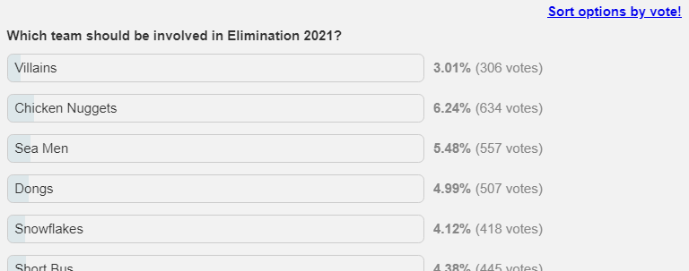

# TORN Forum Poll Sort

Features:

- Sorts forum poll options by vote on TORN.
- Adds position too besides vote count.
- Scales up charts so 100% = highest vote count.

Installation:

1. Install GreaseMonkey/TamperMonkey browser extension.
2. Navigate to [the raw script](https://github.com/juzraai/torn-forum-poll-sort/raw/main/torn-forum-poll-sort.user.js).
3. Click Install.

Before sort:

After sort:

